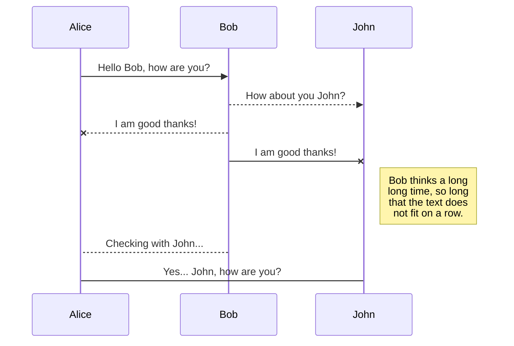
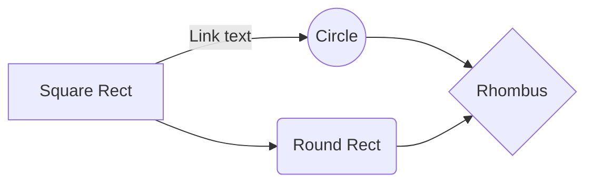

# Objet

Ce document a pour objet de fournir une solution à l'épreuve crypto "[hamac](https://hackropole.fr/fr/challenges/crypto/fcsc2022-crypto-hamac/)" d'hackropole.

# Phase d'étude

Deux fichiers sont fournis pour cette épreuve :

 - Un fichier python `hamac.py`
 - Un fichier json comprenant trois éléments ("iv", "c" et "h")

## Etude du code python

Le code commence par demander un mot de passe, puis génère un HMAC (Hash-based Message Authentication Code) basé sur SHA-256. Une donnée fixe, `b"FCSC2022"`est mise à jour dans l'instance HMAC pour produire un hash unique.

    print("Enter your password")
    password = input(">>> ").encode()
    h = HMAC.new(password, digestmod = SHA256)
    h.update(b"FCSC2022")
Un Vecteur d'Initialisation (IV) aléatoire de 16 octets est généré. L'IV est nécessaire pour le mode CBC. Ensuite, une clé de 256 bits (32 octets) est dérivée du mot de passe en appliquant SHA-256.

    iv = get_random_bytes(16)
    k  = SHA256.new(password).digest()
Le contenu d'un fichier `flag.txt` est lu et rempli pour que sa taille soit un multiple de 16 octets (taille des blocs AES). Le contenu est ensuite chiffré avec AES en mode CBC, en utilisant la clé dérivée et le vecteur d'initialisation.

    c  = AES.new(k, AES.MODE_CBC, iv = iv).encrypt(pad(open("flag.txt", "rb").read(), 16))

Enfin, un dictionnaire contenant les éléments suivants est créé  puis sauvegardé :
-   `iv` : Le vecteur d'initialisation, encodé en hexadécimal ;
-   `c` : Le texte chiffré, encodé en hexadécimal ;
-   `h` : Le HMAC calculé, en format hexadécimal.

Le fichier généré est `output.txt`, fourni dans l'épreuve.

    r = { "iv": iv.hex(), "c": c.hex(), "h": h.hexdigest(), }
    open("output.txt", "w").write(json.dumps(r))

## Elaboration d'un mode d'attaque

Sans connaître le mot de passe utilisé, il est impossible de déchiffrer le fichier fourni. L'auteur nous met cependant sur la voie avec un indice dans la description de l'épreuve :

> Connaissez-vous l’existence de `rockyou` ?

Il semble donc que la solution réside dans l'utilisation du fameux dictionnaire de mot de passe afin de réaliser un "Brut Force Attack". Il y a fort à parier que le mot de passe choisi a été extrait du dictionnaire pour nous faciliter la tâche ...

# Phase de réalisation

Afin de déchiffrer ce fichier, il faudra élaborer un script qui, pour chaque mot de passe présent dans le dictionnaire :
- Calcul le HMAC du mot de passe testé en reproduisant la logique de chiffrement utilisée
- Compare le HMAC obtenu à celui du JSON

Si les HMAC correspondent, nous aurons trouvé le mot de passe. Il ne restera alors qu'à déchiffrer la valeur de "c" en utilisant "iv" et le mot de passe trouvé.

## Open a file

You can open a file from **Google Drive**, **Dropbox** or **GitHub** by opening the **Synchronize** sub-menu and clicking **Open from**. Once opened in the workspace, any modification in the file will be automatically synced.

## Save a file

You can save any file of the workspace to **Google Drive**, **Dropbox** or **GitHub** by opening the **Synchronize** sub-menu and clicking **Save on**. Even if a file in the workspace is already synced, you can save it to another location. StackEdit can sync one file with multiple locations and accounts.

## Synchronize a file

Once your file is linked to a synchronized location, StackEdit will periodically synchronize it by downloading/uploading any modification. A merge will be performed if necessary and conflicts will be resolved.

If you just have modified your file and you want to force syncing, click the **Synchronize now** button in the navigation bar.

> **Note:** The **Synchronize now** button is disabled if you have no file to synchronize.

## Manage file synchronization

Since one file can be synced with multiple locations, you can list and manage synchronized locations by clicking **File synchronization** in the **Synchronize** sub-menu. This allows you to list and remove synchronized locations that are linked to your file.

# Publication

Publishing in StackEdit makes it simple for you to publish online your files. Once you're happy with a file, you can publish it to different hosting platforms like **Blogger**, **Dropbox**, **Gist**, **GitHub**, **Google Drive**, **WordPress** and **Zendesk**. With [Handlebars templates](http://handlebarsjs.com/), you have full control over what you export.

> Before starting to publish, you must link an account in the **Publish** sub-menu.

## Publish a File

You can publish your file by opening the **Publish** sub-menu and by clicking **Publish to**. For some locations, you can choose between the following formats:

- Markdown: publish the Markdown text on a website that can interpret it (**GitHub** for instance),
- HTML: publish the file converted to HTML via a Handlebars template (on a blog for example).

## Update a publication

After publishing, StackEdit keeps your file linked to that publication which makes it easy for you to re-publish it. Once you have modified your file and you want to update your publication, click on the **Publish now** button in the navigation bar.

> **Note:** The **Publish now** button is disabled if your file has not been published yet.

## Manage file publication

Since one file can be published to multiple locations, you can list and manage publish locations by clicking **File publication** in the **Publish** sub-menu. This allows you to list and remove publication locations that are linked to your file.

# Markdown extensions

StackEdit extends the standard Markdown syntax by adding extra **Markdown extensions**, providing you with some nice features.

> **ProTip:** You can disable any **Markdown extension** in the **File properties** dialog.

## SmartyPants

SmartyPants converts ASCII punctuation characters into "smart" typographic punctuation HTML entities. For example:

|                |ASCII                          |HTML                         |
|----------------|-------------------------------|-----------------------------|
|Single backticks|`'Isn't this fun?'`            |'Isn't this fun?'            |
|Quotes          |`"Isn't this fun?"`            |"Isn't this fun?"            |
|Dashes          |`-- is en-dash, --- is em-dash`|-- is en-dash, --- is em-dash|

## KaTeX

You can render LaTeX mathematical expressions using [KaTeX](https://khan.github.io/KaTeX/):

The *Gamma function* satisfying $\Gamma(n) = (n-1)!\quad\forall n\in\mathbb N$ is via the Euler integral

$$
\Gamma(z) = \int_0^\infty t^{z-1}e^{-t}dt\,.
$$

> You can find more information about **LaTeX** mathematical expressions [here](http://meta.math.stackexchange.com/questions/5020/mathjax-basic-tutorial-and-quick-reference).

## UML diagrams

You can render UML diagrams using [Mermaid](https://mermaidjs.github.io/). For example, this will produce a sequence diagram:

And this will produce a flow chart:

